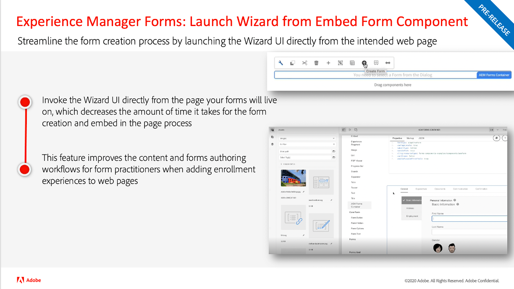
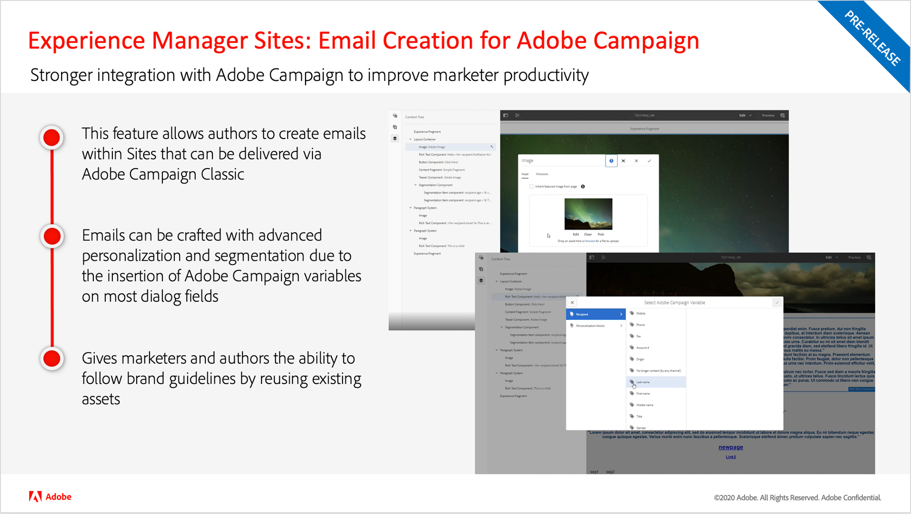

# Adobe Experience Manager as a Cloud Service-release-updates

Bekijk een kort overzicht van de nieuwste functies op Adobe Experience Manager as a Cloud Service. Dit zijn korte, ongeveer 10 minuten durende video&#39;s die door het AEM productteam worden geleverd en die de hooglichten van de nieuwste release delen.

## Laatste update

<table style="max-width: 50%;">
  <tr>
    <td>
      
      

        <a href="./2022/2022-10-0.md">
          <strong>Geen | 2022,10,0</strong>
           
        </a>
          <em>Releasedatum 13 oktober 2022 </em>
      

      

        <a href="https://experienceleague.adobe.com/docs/experience-manager-cloud-service/content/release-notes/release-notes/release-notes-current.html">Opmerkingen bij de release</a>
      

    </td>
  </tr>  
</table>

## Oudere updates

<table style="max-width: 50%;">
  <tr>
    <td>
      
      

        <a href="./2022/2022-8-0.md">
          <strong>Geen | 2022,8,0</strong>
           
        </a>
          <em>Releasedatum september 1, 2022 </em>
      

      

        <a href="https://experienceleague.adobe.com/docs/experience-manager-cloud-service/content/release-notes/release-notes/release-notes-current.html">Opmerkingen bij de release</a>
      

    </td>
    <td>
      
      

        <a href="./2022/2022-7-0.md">
          <strong>Geen | 2022,7,0</strong>
           
        </a>
          <em>Releasedatum 8 aug. 2022 </em>
      

      

        <a href="https://experienceleague.adobe.com/docs/experience-manager-cloud-service/content/release-notes/release-notes/release-notes-current.html">Opmerkingen bij de release</a>
      

    </td>
    <td>
      
      

        <a href="./2022/2022-6-0.md">
          <strong>Geen | 2022,6,0</strong>
           
        </a>
          <em>Releasedatum 30 juni 2022 </em>
      

      

        <a href="https://experienceleague.adobe.com/docs/experience-manager-cloud-service/content/release-notes/release-notes/release-notes-current.html">Opmerkingen bij de release</a>
      

    </td>
  </tr>
  <tr>  
    <td>
      
      

        <a href="./2022/2022-5-0.md">
          <strong>Geen | 2022,5,0</strong>
           
        </a>
          <em>Releasedatum 9 juni 2022 </em>
      

      

        <a href="https://experienceleague.adobe.com/docs/experience-manager-cloud-service/content/release-notes/release-notes/release-notes-current.html">Opmerkingen bij de release</a>
      

    </td>
    <td>
      
      

        <a href="./2022/2022-4-0.md">
          <strong>Geen | 2022,4,0</strong>
           
        </a>
          <em>Uitgegeven op 5 mei 2022 </em>
      

      

        <a href="https://experienceleague.adobe.com/docs/experience-manager-cloud-service/content/release-notes/release-notes/release-notes-current.html">Opmerkingen bij de release</a>
      

    </td>
    <td>
      
      

        <a href="./2022/2022-3-0.md">
          <strong>Geen | 2022,3,0</strong>
           
        </a>
          <em>Release: 31 maart 2022 </em>
      

      

        <a href="https://experienceleague.adobe.com/docs/experience-manager-cloud-service/content/release-notes/release-notes/release-notes-current.html">Opmerkingen bij de release</a>
      

    </td>
  </tr>
  <tr>     
    <td>
      
      

        <a href="./2022/2022-1-0.md">
          <strong>Geen | 2022,1,0</strong>
           
        </a>
          <em>Release van 3 februari 2022 </em>
      

      

        <a href="https://experienceleague.adobe.com/docs/experience-manager-cloud-service/content/release-notes/release-notes/2022/release-notes-2022-1-0.html">Opmerkingen bij de release</a>
      

    </td>
    <td>
      
      

      <a href="./2021/2021-11-0.md">
          <strong>Geen | 2021.11.0</strong>
           
        </a>
      <em>Release van 16 december 2021</em>
      

      

        <a href="https://experienceleague.adobe.com/docs/experience-manager-cloud-service/content/release-notes/release-notes/2021/release-notes-2021-11-0.html">Opmerkingen bij de release</a>
      

    </td>
  </tr>
</table>

